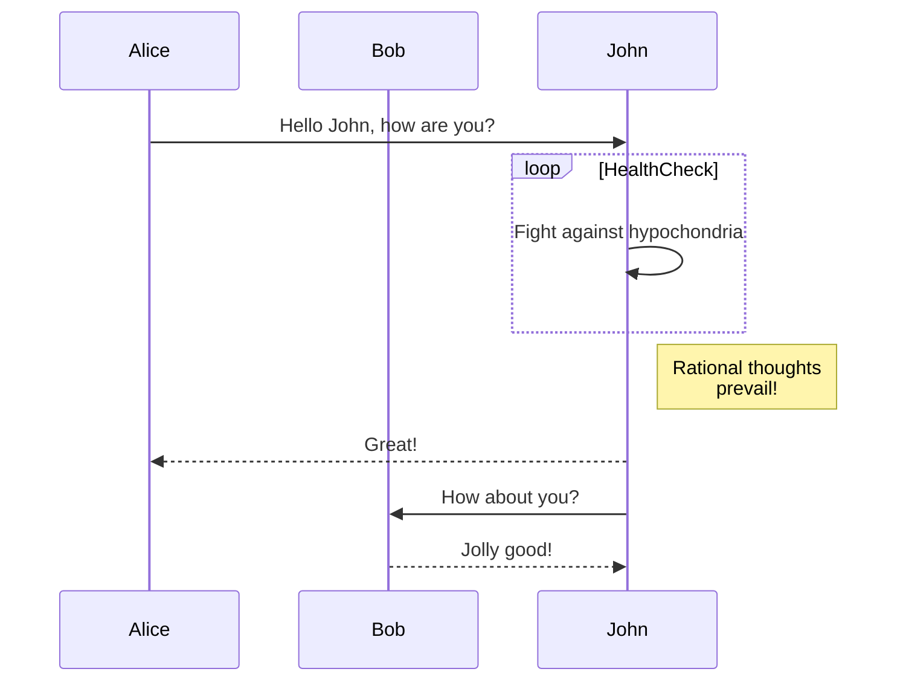
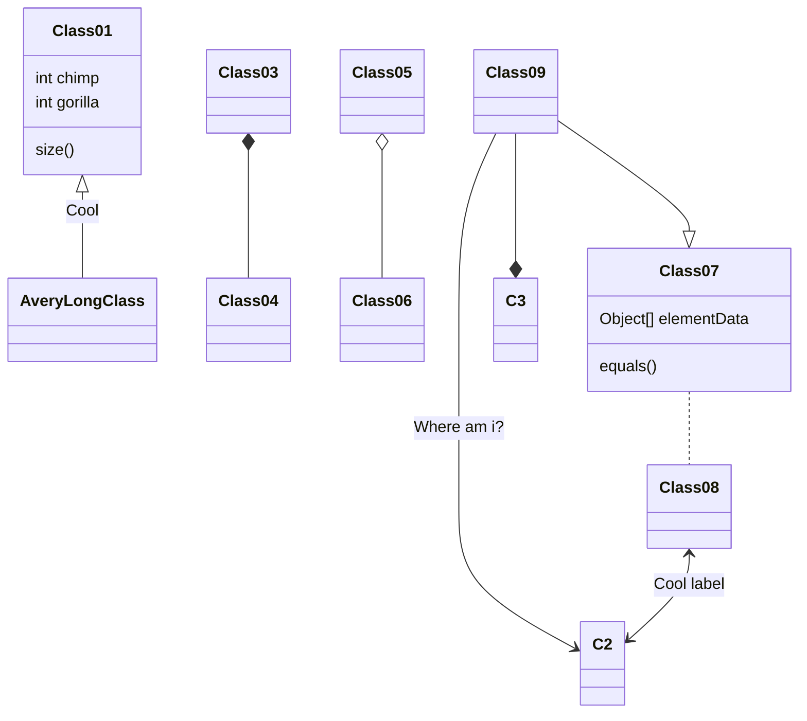

# Markdown 渲染器测试报告

> **测试目的**：验证渲染引擎对 GFM 标准、MathJax 物理公式、Mermaid 动态图表及 Typora 扩展语法的解析精度与排版美感。
>
> **测试说明**：本篇文档包含了大量的嵌套逻辑，用于检测 CSS 样式的层级污染及容器溢出处理。

------

## 标题层级

# 一级标题

## 二级标题

### 三级标题

#### 四级标题

##### 五级标题

###### 六级标题

普通段落之间会自动分段。

这是第二段，用于测试段间距与行高。

------

## 链接与页面内跳转

### 外部链接

- GitHub 官方网站：https://github.com
- OpenAI 官网：https://openai.com
- 使用 Markdown 链接语法：[GitHub Docs](https://docs.github.com)

### 页面内锚点跳转

点击跳转到：

- [跳转到脚注章节](#脚注)
- [跳转到 Mermaid 图表章节](#mermaid-图表)
- 一个跳转到其它测试的数学公式链接 [$E=mc^2$](#其它测试)

### 自动链接识别

GitHub 与 Typora 通常会自动识别：

- https://example.com
- mailto:test@example.com

------

## 文本格式与 Typora 扩展

### 基础文本格式

- **基础格式**：*斜体*，**粗体**，***粗斜体\***，~~删除线~~，以及下划线文本。
- **转义字符测试**：*这是斜体*，这是粗体。

### Typora 扩展高亮与上下标

- **高亮**：==这是 Typora 风格高亮文本==
- **上标与下标**：数学、化学中常用的 `^上标^` ($x^2$) 与 `~下标~` ($H_2O$) 语法兼容。

### Emoji 与特殊符号

#### Emoji 短代码

支持 GitHub 风格 Emoji：

`:s​mi​l​e:`:smile:, `:rocket:` :rocket:, `:heart:` :heart:, `:tada:` :tada:, `:warning:` :warning:

渲染效果通常如下：

😄 🚀 ❤️ 🎉 ⚠️

#### 特殊符号与 HTML 实体

© 版权符号 | ® 注册商标 | ™ 商标 | ° 度符号

------

## 列表与数据展示

### 无序列表

- 苹果
- 香蕉
  - 黄色香蕉
  - 青色香蕉
- 橙子

### 有序列表

1. 安装 Node.js
2. 安装依赖
3. 执行构建
4. 发布页面

### 任务列表

-  [x] Markdown 基础解析
-  [x] GFM 表格支持
-  [x] Emoji 渲染
-  [ ] 移动端适配

### 基础表格

|   功能   | GitHub | Typora | VSCode |
| :------: | :----: | :----: | :----: |
| GFM 表格 |   ✅    |   ✅    |   ✅    |
| Mermaid  |   ✅    |   ✅    |   ⚠️    |
| 数学公式 |   ⚠️    |   ✅    |   ⚠️    |
|  Emoji   |   ✅    |   ✅    |   ✅    |

### 响应式与对齐表格

测试表格的对齐方式、Emoji 支持以及长文本换行。

| 序号 | 左对齐测试                               |  居中对齐测试  |        右对齐测试 | 状态 |
| :--: | :--------------------------------------- | :------------: | ----------------: | :--: |
|  1   | 左对齐文本内容                           |  居中文本内容  |        右对齐文本 |  ✅   |
|  2   | 多行测试第二行                           | 多行测试第二行 |    多行测试第二行 |  ✅   |
|  3   | 这是一个较长的文本用于测试表格单元格宽度 |   🚀 引擎启动   | $E=mc^2$ 混合测试 |  ✅   |

### 深度嵌套列表

#### 简单嵌套

1. 一级列表
   - 二级列表
     - 三级列表
       - 四级列表

#### 列表内嵌套结构

测试列表中的元素嵌套，以及代码块的缩进级别是否正确：

1. 第一步骤

   - 子项目一

   - 子项目二

     ```bash
     # 在列表中嵌入代码块
     npm install --save hoigin-blog-engine
     ```
   
2. 第二步骤

   - [x] 已完成的嵌套任务

   - [ ] 待处理的嵌套任务

   - 包含引用的列表项：

     > 这是一个在列表内部的引用块。
     >
     > 它应该正确地跟随列表的缩进。

------

## 引用与代码高亮

### 引用块

下面是一个空的引用：

>  

下面是一个非空引用：

> 这是非空引用。

下面是嵌套引用：

> 这是一个普通引用。
>
> > 这是嵌套引用。

### 行内代码与代码块

请执行 `npm install` 安装依赖。

```bash
npm install
npm run build
npm run dev
{
  "name": "markdown-render-test",
  "version": "1.0.0",
  "private": true
}
```

### 高级函数式编程

这段代码测试了闭包、装饰器以及 Python 3.10+ 的类型注解：

```python
from typing import Callable

def debug_logger(prefix: str) -> Callable:
    """这是一个用于测试长注释换行以及装饰器语法的函数"""
    def decorator(func: Callable):
        def wrapper(*args, **kwargs):
            print(f"[{prefix}] 正在调用 {func.__name__}，参数包含：{args}")
            return func(*args, **kwargs)
        return wrapper
    return decorator

@debug_logger(prefix="TEST-ENGINE")
def complex_logic(data: list[int]) -> int:
    # 测试列表推导式的渲染
    return sum([x**2 for x in data if x % 2 == 0])
```

### 前端工程化

测试异步处理与类装饰器的着色效果：

```typescript
async function fetchData(url: string): Promise<Record<string, any>> {
    const response = await fetch(url);
    if (!response.ok) throw new Error("网络请求异常，请检查渲染引擎");
    return response.json();
}
```

### 小众语言高亮

测试渲染引擎对小众语言（如 Haskell）的模式匹配、类型签名以及特定操作符（如 `->` 和 `++`）的解析支持：

```Haskell
-- Calculate the nth Fibonacci number
fibonacci :: Int -> Int
fibonacci 0 = 0
fibonacci 1 = 1
fibonacci n = fibonacci (n - 1) + fibonacci (n - 2)

-- A simple quicksort implementation in Haskell
quickSort :: Ord a => [a] -> [a]
quickSort []     = []
quickSort (p:xs) = (quickSort lesser) ++ [p] ++ (quickSort greater)
    where
        lesser  = filter (< p) xs
        greater = filter (>= p) xs
```

------

## 脚注

Markdown 支持脚注语法[^first]，非常适合技术文档与学术写作[^second]。

也可以连续引用多个脚注[^first]。

[^first]: 脚注是可以**加粗**的。
[^second]: 这是第二个脚注。

------

## 数学公式

### 基础公式

行内公式：$E = mc^2$

块级公式：

$$
\int_{-\infty}^{+\infty} e^{-x^2}dx = \sqrt{\pi}
$$

### 多行对齐的数学公式

量子统计中，费米子与玻色子的占据数分布是核心。以下公式测试了 `\begin{align}` 环境下的多行对齐与文本嵌入能力：

$$
\begin{align}
\text{Fermi: } \Xi_l &=\sum_{a_l=0}^1e^{-(\alpha+\beta \varepsilon_l)a_l}=1+e^{-(\alpha+\beta \varepsilon_l)} \quad \overline{a_l}=\frac{1}{e^{\alpha+\beta \varepsilon_l}+1}
\\
\text{Bose: } \Xi_l &=\sum_{a_l=0}^{\infty}e^{-(\alpha+\beta \varepsilon_l)a_l}=\frac{1}{1-e^{-(\alpha+\beta \varepsilon_l)}} \quad \overline{a_l}=\frac{1}{e^{\alpha+\beta \varepsilon_l}-1}
\end{align}
$$

### 含有矩阵的数学公式

测试大括号 `\begin{pmatrix}` 的缩放比例，以及分数线在复杂指数中的渲染效果：

$$
e^{-\frac{it}{\hbar}H}=\cos(\frac{E}{\hbar}t)
\begin{pmatrix}
1 & 0 \\
0 & 1 \\
\end{pmatrix}
+\sin(\frac{E}{\hbar}t)
\begin{pmatrix}
0 & -1 \\
1 & 0 \\
\end{pmatrix}
=
\begin{pmatrix}
\cos(\frac{E}{\hbar}t) & -\sin(\frac{E}{\hbar}t) \\
\sin(\frac{E}{\hbar}t) & \cos(\frac{E}{\hbar}t) \\
\end{pmatrix}
$$

### 含有物理特有符号的数学公式

测试 `\bra`、`\ket`、`\braket` 等 Dirac 符号，以及 `\hbar`、`\dagger` 等量子力学常用符号的渲染效果：

行内公式：$\langle \psi | A | \phi \rangle = \braket{\psi|A|\phi}$

块级公式：

$$
\begin{align}
\hat{H}|\psi\rangle &= E|\psi\rangle \\
|\psi\rangle &= \sum_n c_n |n\rangle \\
\langle \psi | &= \sum_n c_n^* \langle n | \\
\braket{\psi|\phi} &= \sum_n c_n^* d_n \\
|\psi\rangle^\dagger &= \langle \psi |
\end{align}
$$

含算符的期望值表达式：

$$
\langle A \rangle = \frac{\bra{\psi} A \ket{\psi}}{\braket{\psi|\psi}} = \frac{\int \psi^*(x) \hat{A} \psi(x) \, dx}{\int |\psi(x)|^2 \, dx}
$$

### 含有化学特有符号的数学公式

测试 `\ce` 化学方程式宏的渲染效果。`\ce` 是 MathJax 的 mhchem 扩展提供的语法，用于排版化学反应方程式：

行内化学式：$\ce{H2O}$、$\ce{CO2}$、$\ce{SO4^2-}$

化学方程式：

$$
\ce{2H2 + O2 -> 2H2O}
$$

可逆反应与条件标注：

$$
\ce{N2 + 3H2 <=>[高温、高压][催化剂] 2NH3}
$$

含沉淀与气体的反应：

$$
\ce{BaCl2 + Na2SO4 -> BaSO4 v + 2NaCl}
$$

氧化还原半反应：

$$
\ce{Fe^{2+} ->[氧化] Fe^{3+} + e^-}
$$


------

## Mermaid 图表

纯文本绘图是高效博主的必备技能。以下测试 `mermaid` 图表渲染，确保图表中字符宽度的计算准确无误。

### 时序图

测试参与者交互、循环体嵌套以及注释框的排版：



### 类图

测试类之间的继承、组合关系及连线标签的显示：



------

## GitHub 风格警示嵌套压力测试

这是目前最复杂的渲染场景之一。我们将从基础语法开始，逐渐过渡到测试多层 `>` 嵌套下的样式溢出和空行处理。

### 简单 Alerts

下面是基础的 GitHub Alert：

> [!important]
>
> 这件事很重要！  

> [!caution]
>
> 注意！

### 极端嵌套结构 (带空行与代码块)

以下是引擎核心压力测试区，务必检查缩进、背景框边距以及空白行的渲染是否完美复刻：

**复杂嵌套测试 A：**

> [!important]
>
> > [!caution]
> >
> > > [!tip]
> > >
> > > > [!note]
> > > >
> > > > > [!warning]
> > > > >
> > > > > ```bash
> > > > > echo "Warning"
> > > > > ```
> > > > >
> > > > > 下面一行有一个空格。
> > > > >
> > > > >  
> > > >
> > > >  
> > > >
> > > > 上面一行有一个空格。
> > >
> > >  
> >
> >  
>
>  

**复杂嵌套测试 B：**

> [!important]
>
> > [!caution]
> >
> > > [!tip]
> > >
> > > > [!note]
> > > >
> > > > > [!warning]
> > > > >
> > > > > ```bash
> > > > > echo "Important"
> > > > > ```
> > > > >
> > > > > 下面一行有一个空格。
> > > > >
> > > > > 
> > > >
> > > > 
> > > >
> > > > 上面一行有一个空格。
> >
> > 

------

## 其它测试

### 极端长字符溢出测试

ABCDEFGHIJKLMNOPQRSTUVWXYZ_ABCDEFGHIJKLMNOPQRSTUVWXYZ_ABCDEFGHIJKLMNOPQRSTUVWXYZ_0123456789（此行应在容器内自动换行或显示滚动条，不可撑开整个页面布局）

`a_very_very_very_very_very_very_very_very_very_very_very_very_very_very_very_long_code_between_lines`（此行应在容器内自动换行或显示滚动条，不可撑开整个页面布局）

### HTML 标签混排

<p style="text-align: left; color: orange">这是一个橙色的靠左对齐的 HTML 段落</p>

<p style="text-align: center; color: purple">这是一个紫色的居中对齐的 HTML 段落</p>

<p style="text-align: right; color: green">这是一个绿色的靠右对齐的 HTML 段落。</p>

### 图片缩放与描述


总之，此文档包含了 Markdown 渲染引擎需要面对的几乎所有严苛的边界条件，而在浏览器页面中能得到几乎完美的呈现！